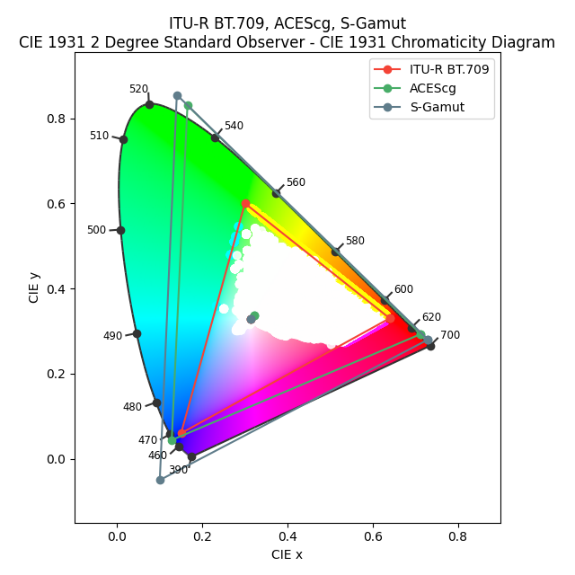

# bgr 2 CIE 1931 

## install
```python
pip install -r requirements.txt
```

## run
```python
python bgr2CIE.py
```

## results
The results lies in `./data/huoguo` folder. For example, 

<center class='half'>
	
</center>